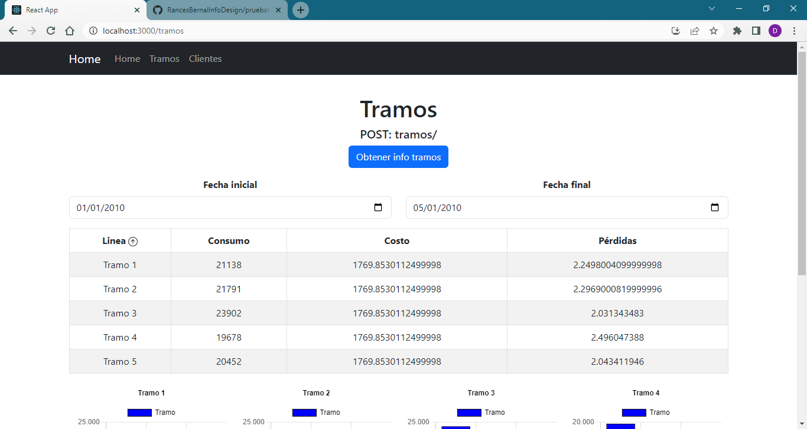
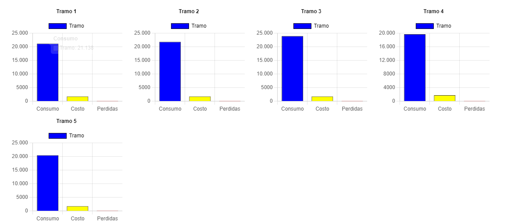
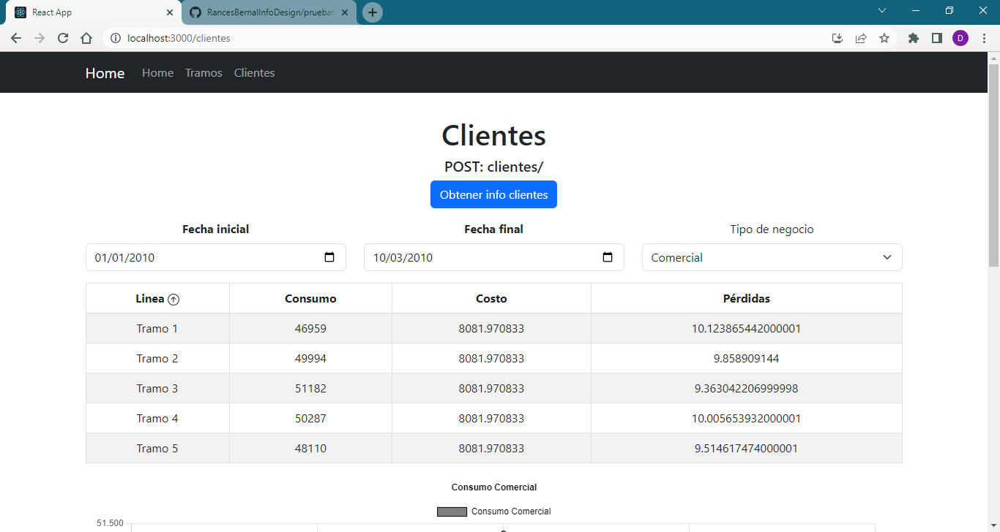
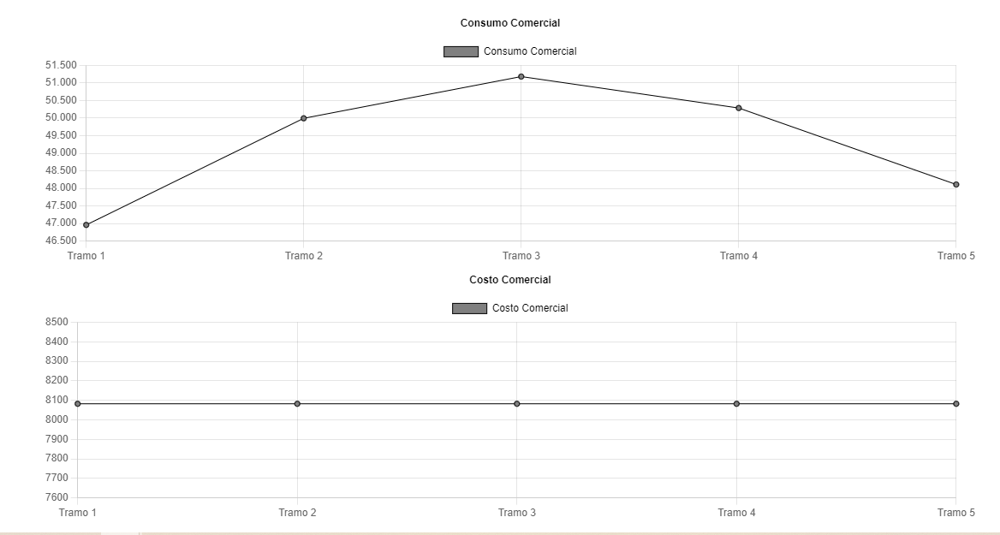

# Prueba técnica PeakU

Creado por: David Enrique Palacios García

- LinkedIn: [David Palacios](https://www.linkedin.com/in/david-palaciosg/)
- GitHub: [David Palacios](https://github.com/davidpalaciosg)

## Herramientas utilizadas
- React JS + Typescript
- React Bootstrap + Icons
- React Router
- ChartJS (React)
- Axios: peticiones HTTP
- Sass: estilos

## Descripción
El proyecto busca conectarse a un backend para obtener datos y, a partir de ellos, presentar la información en tablas y gráficos que permitan visualizar la información de manera más amigable.

Las tablas son dinámicas, es decir, se pueden ordenar por cualquiera de sus columnas y esto, a su vez, actualiza las gráficas.

## Consideraciones
- El backend se encuentra disponible en el siguiente enlace: [GitHub](https://github.com/RancesBernalInfoDesign/pruebatecnicainfodesignback). Requiere adicionar CORS para funcionar correctamente.
- A partir de los botones se encadenan las peticiones HTTP y con la información obtenida se crean las tablas y los gráficos.

## Instrucciones de uso
1. Clonar el repositorio backend y seguir las instrucciones de uso.
2. Clonar el repositorio frontend (este).
3. En consola, ejecutar `npm install` para instalar las dependencias.
4. En consola, ejecutar `npm start` para iniciar el proyecto sobre el puerto 3000.

## Capturas de pantalla

### Tramos

### Clientes

